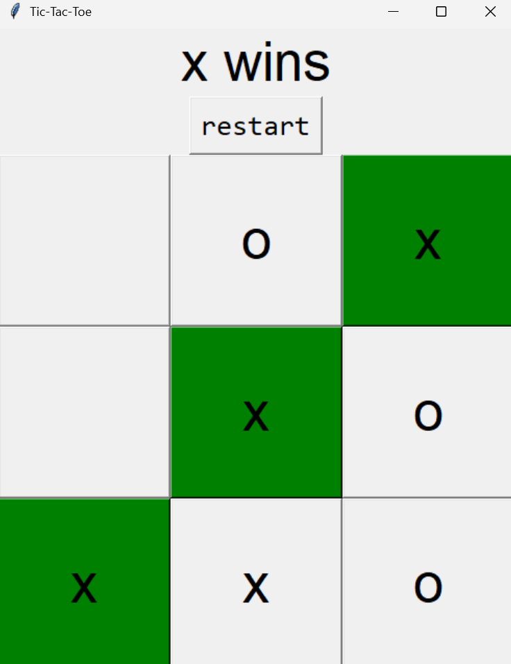
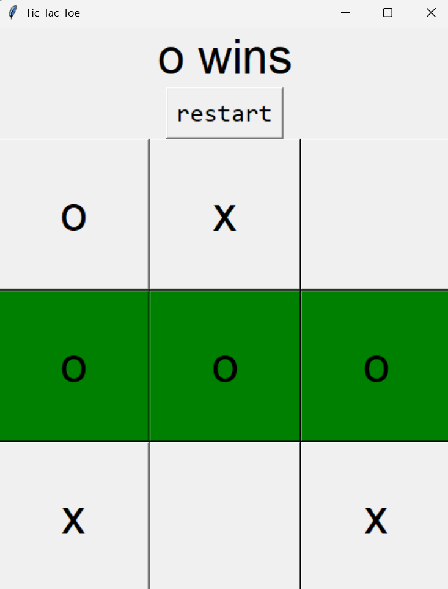
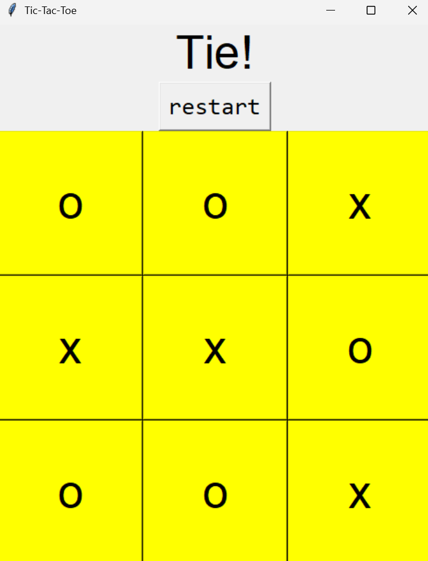

# 🕹️ Tic-Tac-Toe Game (Python with Tkinter)

A simple and fun Tic-Tac-Toe (X & O) game built using Python and the Tkinter GUI library.

## 🎮 Features

- 2-player game (X vs O)
- Graphical user interface with clickable buttons
- Random player starts each game
- Automatically detects:
  - Wins (with green highlight on winning cells)
  - Ties (with yellow highlight)
- Restart button to play a new game instantly

## 🖼️ Screenshots





## 🛠️ How to Run

### Requirements
- Python 3.x  
- Tkinter (usually included by default with Python)

### Run the Game
1. Clone this repository or download the `.py` file:
    ```bash
    git clone https://github.com/yourusername/tictactoe-tkinter.git
    cd tictactoe-tkinter
    ```

2. Run the Python file:
    ```bash
    python tictactoe.py
    ```

## 🧠 Game Rules

- The game is played on a 3x3 grid.
- Players take turns clicking on empty cells to mark their symbol (X or O).
- First player to align 3 of their symbols horizontally, vertically, or diagonally wins.
- If all cells are filled without a winner, it's a tie.

## 🙏 Credits

This project was inspired by the following YouTube tutorial:  
📺 [Python Tic Tac Toe GUI Tutorial using Tkinter](https://www.youtube.com/watch?v=V9MbQ2Xl4CE&list=WL&index=8)

## 📁 File Structure

```
tictactoe-tkinter/
│
├── tictactoe.py     # Main Python file with GUI and logic
├── README.md        # This README file
```
